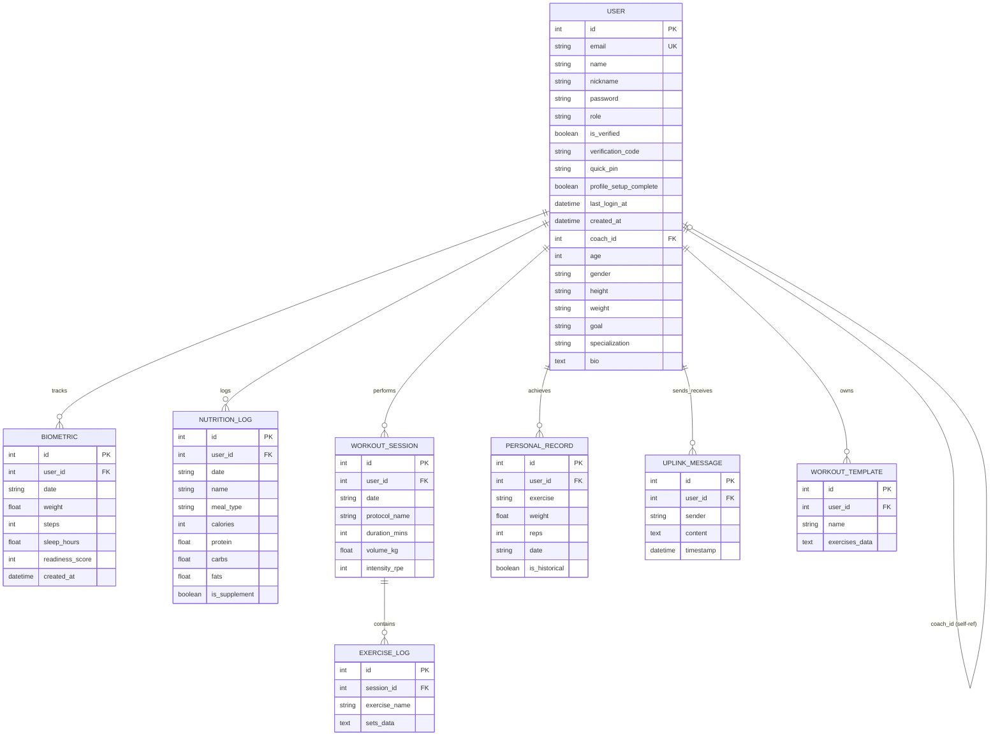
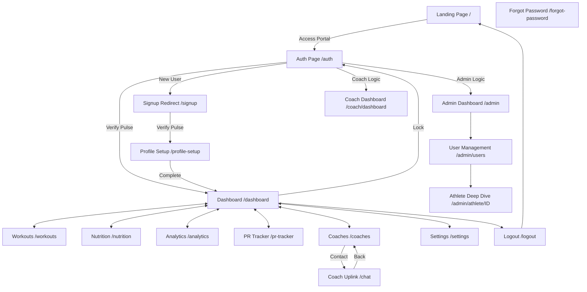

# NYXft System Architecture Diagrams

## 1. Entity-Relationship (ER) Diagram

```mermaid
erDiagram
    USER ||--o{ BIOMETRIC : tracks
    USER ||--o{ NUTRITION_LOG : logs
    USER ||--o{ WORKOUT_SESSION : performs
    USER ||--o{ PERSONAL_RECORD : achieves
    USER ||--o{ UPLINK_MESSAGE : sends_receives
    USER ||--o{ WORKOUT_TEMPLATE : owns
    USER ||--o| USER : "coach_id (self-ref)"
    WORKOUT_SESSION ||--o{ EXERCISE_LOG : contains

    USER {
        int id PK
        string email UK
        string name
        string nickname
        string password
        string role
        boolean is_verified
        string verification_code
        string quick_pin
        boolean profile_setup_complete
        datetime last_login_at
        datetime created_at
        int coach_id FK
        int age
        string gender
        string height
        string weight
        string goal
        string specialization
        text bio
    }

    BIOMETRIC {
        int id PK
        int user_id FK
        string date
        float weight
        int steps
        float sleep_hours
        int readiness_score
        datetime created_at
    }

    NUTRITION_LOG {
        int id PK
        int user_id FK
        string date
        string name
        string meal_type
        int calories
        float protein
        float carbs
        float fats
        boolean is_supplement
    }

    WORKOUT_SESSION {
        int id PK
        int user_id FK
        string date
        string protocol_name
        int duration_mins
        float volume_kg
        int intensity_rpe
    }

    EXERCISE_LOG {
        int id PK
        int session_id FK
        string exercise_name
        text sets_data
    }

    PERSONAL_RECORD {
        int id PK
        int user_id FK
        string exercise
        float weight
        int reps
        string date
        boolean is_historical
    }

    UPLINK_MESSAGE {
        int id PK
        int user_id FK
        string sender
        text content
        datetime timestamp
    }

    WORKOUT_TEMPLATE {
        int id PK
        int user_id FK
        string name
        text exercises_data
    }
```

## 2. Page Interconnection (Flow) Diagram

```mermaid
graph TD
    %% Public Pages
    Index[Landing Page /]
    Auth[Auth Page /auth]
    Signup[Signup Redirect /signup]
    Forgot[Forgot Password /forgot-password]

    %% Onboarding
    Setup[Profile Setup /profile-setup]

    %% Core App (Dashboard Hub)
    Dash[Dashboard /dashboard]
    
    %% Orbital Navigation Items
    Workouts[Workouts /workouts]
    Nutrition[Nutrition /nutrition]
    Analytics[Analytics /analytics]
    PRs[PR Tracker /pr-tracker]
    Coaches[Coaches /coaches]
    Chat[Coach Uplink /chat]
    Settings[Settings /settings]

    %% Admin/Coach Portals
    AdminDash[Admin Dashboard /admin]
    CoachDash[Coach Dashboard /coach/dashboard]
    AdminUsers[User Management /admin/users]
    AdminAthlete[Athlete Deep Dive /admin/athlete/ID]

    %% Authentication Flow
    Index -->|Access Portal| Auth
    Auth -->|New User| Signup
    Signup -->|Verify Pulse| Setup
    Auth -->|Verify Pulse| Dash
    Setup -->|Complete| Dash

    %% Main Navigation (The Orb)
    Dash <--> Workouts
    Dash <--> Nutrition
    Dash <--> Analytics
    Dash <--> PRs
    Dash <--> Coaches
    Dash <--> Settings
    
    Coaches -->|Contact| Chat
    Chat -->|Back| Coaches

    %% Admin/Coach Access
    Auth -->|Admin Logic| AdminDash
    Auth -->|Coach Logic| CoachDash
    AdminDash --> AdminUsers
    AdminUsers --> AdminAthlete

    %% System Actions
    Dash -->|Lock| Auth
    Logout[Logout /logout]
    Dash --> Logout
    Logout --> Index
```
